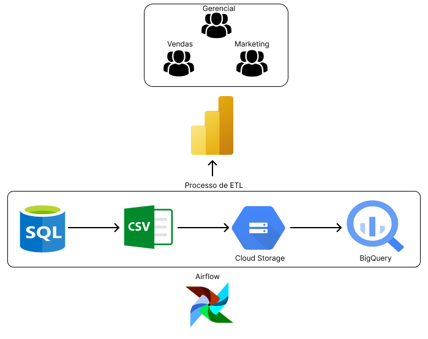

# Projeto de Arquitetura de Dados na GCP

## Introdução

Recentemente, comecei a explorar o free tier da GCP para criar uma arquitetura de dados simples, eficiente e gratuita! Os principais objetivos da arquitetura foram: simplicidade, custo zero por maior tempo possível e qualidade dos dados. Acho que essa pode ser uma ótima opção para pequenas e médias empresas que ainda não têm uma estrutura de dados ou que querem evoluir nessa área e movimentam pouco volume.

## Arquitetura

A arquitetura consiste em:

- **Airflow self-hosted:** Orquestrador do processo de ELT.

- **SQL SERVER (simulando um banco de dados operacional):** Fonte de dados simulando um banco operacional.

- **Cloud storage:** Armazenamento de arquivos de extração.

- **BigQuery:** Data warehouse para análise.

Utilizei Power BI para visualização, ainda estou pensando em usar o Metabase por ser gratuito! Para simplificar o projeto, eu não criei uma "raw zone" no BigQuery e nem usei o DBT para criar os pipelines, mas pretendo testar essas alternativas no futuro.

## Evolução do Projeto

Alguns tópicos que desejo implementar para tornar o projeto mais acessível e viável:

- Utilizar Parquet ao invés de CSV para poupar armazenamento.

- Implementar Monitores no BigQuery.

- Criar uma RAW zone e o DW no BigQuery (Hoje está apenas estruturado em 1 único stage).

- Utilizar DBT para processar dentro do BQ.

## Free Tier

Limites do Free Tier:

- **Cloud Storage:** 5 GB/mês de armazenamento.

- **BigQuery:** 10 GB/mês de armazenamento + 1T de transação de dados.

- **Airflow self-hosted:** Instalado no Docker localmente para orquestrar as pipelines.

## Docker - SQL Server

Instalação do SQL SERVER NO DOCKER:
docker run --name sqlserver -e "ACCEPT_EULA=Y" -e "SA_PASSWORD=digite-sua-senha-aqui" -p 1433:1433 -d mcr.microsoft.com/mssql/server:2019-CU15-ubuntu-20.04
# Airflow

O Airflow foi escolhido como orquestrador do processo de ELT no projeto. Algumas características incluem:

- **Scripts SQL Incrementais:** Utilizados para a extração, transformação e carga (ETL) dos dados de forma incremental.

- **Scripts FULL Incrementais:** Processamento completo de dados em momentos específicos.

- **Scripts CREATE TABLES (BigQuery):** Utilizados para criar e atualizar tabelas no BigQuery.

- **Aviso por Email:** Configurado para notificar sobre o status e eventuais problemas nas pipelines.

- **Execução uma vez ao dia:** As pipelines são executadas diariamente para manter os dados atualizados.

# Power BI - Visualização dos Dados

O Power BI foi a ferramenta escolhida para visualização dos dados. Algumas das principais visualizações incluem:

- **Curva ABC + Pareto (Clientes):** Análise de clientes com base na relevância de suas contribuições.

- **Vendas ao longo do Tempo:** Gráficos temporais para análise de tendências.

- **Top 10 Produtos:** Destaque para os produtos mais vendidos.

- **Resumo de Pedidos:** Visão geral dos pedidos, resumindo informações essenciais.

# Considerações Finais

Este projeto tem como objetivo fornecer uma solução de arquitetura de dados acessível e eficiente para pequenas e médias empresas. As próximas etapas incluem a implementação de melhorias e a avaliação contínua de ferramentas adicionais para otimização do processo. A escolha de ferramentas gratuitas e o uso do free tier da GCP refletem a busca por custos mínimos em um ambiente de dados funcional.
